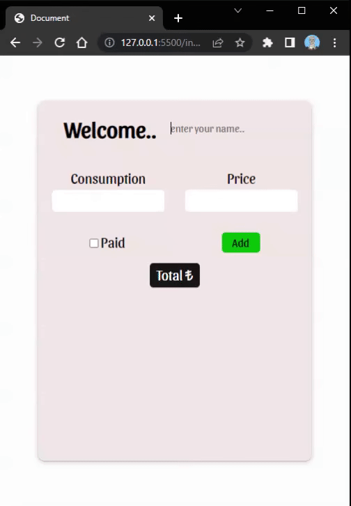

<h1>Expense Calculator</h1>

An expense calculator was created to consumer to checked their expenses.

<h2>Which tecnologies was used?</h2>

 Html, Css, Scss and Java Script was used in project.

 The project consists of a content row which contains inputs called consumption and price, a checkbox to signify payment, a button to add content, and a total bar. 
Whenever the user adds a new item, the counter adds that item's cost and total amount update, likewise if the user deletes an item, its price is dropped.

<h2>Screen Recording </h2>

